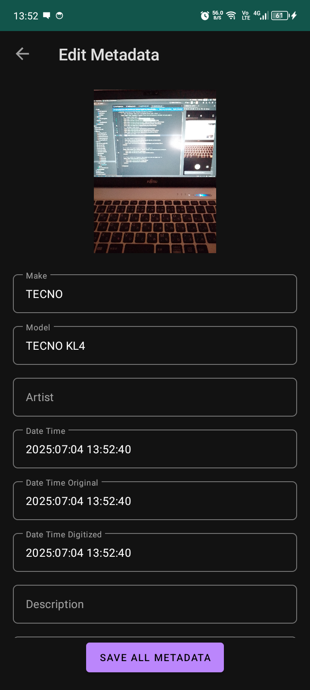
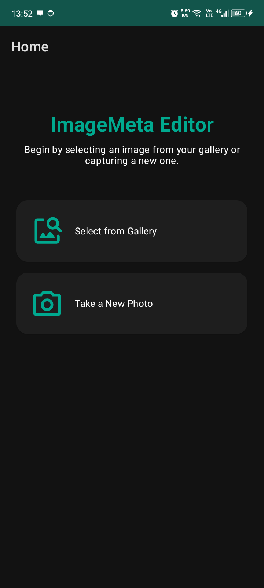

# ImageMeta

ImageMeta is an Android app for viewing and editing comprehensive image metadata including EXIF, IPTC, and XMP formats.  
It allows you to browse images, view organized metadata, edit tags, perform batch operations, and analyze metadata patterns.

## Features

### 🔍 Enhanced Metadata Extraction
- **Multi-format Support**: View EXIF, IPTC, and XMP metadata
- **Organized Categories**: Metadata grouped into logical sections (Basic Info, Camera Settings, Location, etc.)
- **Format Indicators**: Clear labels showing metadata source (EXIF/IPTC/XMP)
- **Comprehensive Coverage**: 50+ metadata fields supported

### ✏️ Advanced Editing Capabilities
- **Single Image Editing**: Edit individual metadata fields with real-time validation
- **Batch Processing**: Select multiple images and apply changes to all at once
- **GPS Coordinate Management**: Dedicated interface for location data editing
- **Category Filtering**: Focus on specific metadata types (Basic, Camera, Location)

### 📊 Data Visualization & Analytics
- **Metadata Distribution Charts**: See camera model and ISO value patterns
- **GPS Availability Analysis**: Track which images have location data
- **Interactive Charts**: Pie charts and bar graphs for visual insights
- **Bulk Analysis**: Process multiple images simultaneously

### 🗺️ Location Integration
- **GPS Coordinate Display**: View and edit latitude/longitude values
- **Coordinate Validation**: Ensure GPS data is within valid ranges
- **Location Formatting**: Human-readable coordinate display
- **Map-Ready**: Infrastructure for Google Maps integration

### 🎨 Modern UI/UX
- **Material Design 3**: Clean, modern interface following Google's design guidelines
- **Dark Mode Support**: Automatic theme switching
- **Responsive Layout**: Works on phones and tablets
- **Intuitive Navigation**: Easy access to all features from the home screen

## Screenshots

<table>
  <tr>
    <td></td>
    <td></td>
  </tr>
  <tr>
    <td align="center">Enhanced Home Screen</td>
    <td align="center">Categorized Metadata View</td>
  </tr>
</table>

## How It Works

### Single Image Workflow
1. **Select Image**: Choose from gallery or capture new photo
2. **View Metadata**: See organized metadata in categories with format indicators
3. **Filter & Focus**: Use category chips to view specific metadata types
4. **Edit Values**: Modify metadata fields with validation
5. **View Location**: Access GPS coordinates in dedicated location view
6. **Save Changes**: Create new image file with updated metadata

### Batch Processing Workflow
1. **Select Multiple Images**: Choose several images for bulk editing
2. **Template Editing**: Modify common metadata fields
3. **Apply to All**: Propagate changes across all selected images
4. **Progress Tracking**: Monitor batch processing with status updates
5. **Bulk Analysis**: Generate analytics for the image collection

### Analytics & Insights
1. **Select Image Collection**: Choose multiple images for analysis
2. **Automatic Processing**: Extract metadata from all images
3. **Visual Charts**: View distribution patterns and trends
4. **Export-Ready**: Data formatted for further analysis

## Technical Features

### Metadata Formats Supported
- **EXIF**: Camera settings, dates, GPS, technical details
- **IPTC**: Keywords, captions, copyright, location names
- **XMP**: Extended metadata, ratings, user-defined fields

### Advanced Capabilities
- **Smart GPS Parsing**: Automatic conversion between DMS and decimal formats
- **Validation Engine**: Ensure metadata integrity and format compliance
- **Efficient Processing**: Optimized for handling large image collections
- **Error Handling**: Graceful handling of corrupted or missing metadata

## Requirements

- Android 7.0 (API 24) or higher
- Storage permissions for image access
- 50MB free space for app and processed images

## Build & Run

1. Clone the repository:
   ```bash
   git clone https://github.com/jksalcedo/imagemeta-app.git
   ```
2. Open in Android Studio Arctic Fox or later
3. Sync Gradle dependencies (includes MPAndroidChart, metadata-extractor)
4. Run on device or emulator with API 24+

## Libraries Used

- **AndroidX**: Core app architecture and UI components
- **Material Components**: Modern UI design system
- **Navigation Component**: Fragment navigation and safe args
- **metadata-extractor**: IPTC and XMP metadata reading
- **MPAndroidChart**: Data visualization and charts
- **Glide**: Efficient image loading and display

## Notes

- **Original Preservation**: Original images are never modified
- **New File Creation**: Edited metadata saved in new image copies
- **Organized Storage**: Processed images saved in `Pictures/ImageMeta/`
- **Batch Storage**: Bulk processed images in `Pictures/ImageMeta/Batch/`
- **Performance**: Optimized for processing 100+ images efficiently

## Future Enhancements

- **Google Maps Integration**: Interactive map views for GPS coordinates
- **Cloud Storage Support**: Integration with Google Drive, Dropbox
- **Metadata Templates**: Save and reuse common metadata patterns
- **Export Capabilities**: CSV/JSON export for metadata analysis
- **Advanced Filtering**: Search and filter by metadata values
